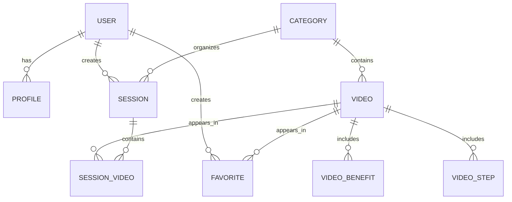

# Entity Relationship Diagram

The following diagram illustrates the main entities and relationships used by the current Django schema.

## Entity Notes

- USER refers to Django's built-in authentication user model.
- PROFILE stores additional user fitness and personal information.
- CATEGORY organizes content into reusable topic buckets.
- VIDEO is the main content entity for yoga or fitness lessons.
- FAVORITE links users to videos they have saved.
- SESSION tracks a user's workout progression across selected videos.
- SESSION_VIDEO represents progress for each video inside a session.
